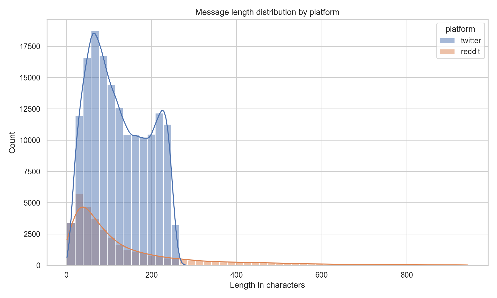
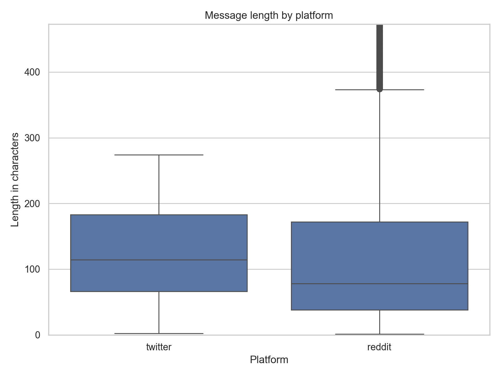
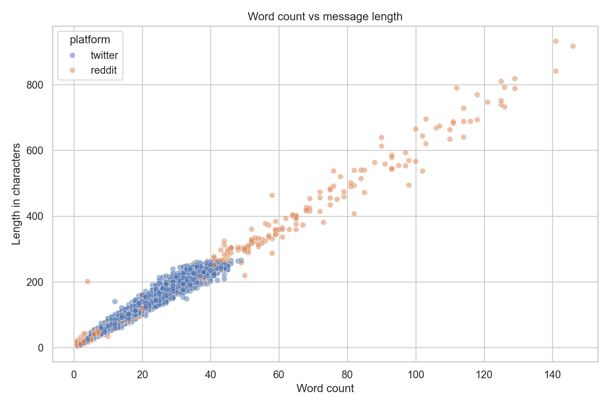
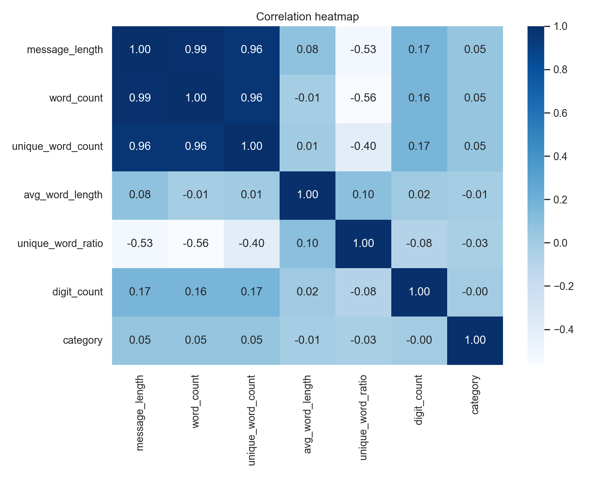
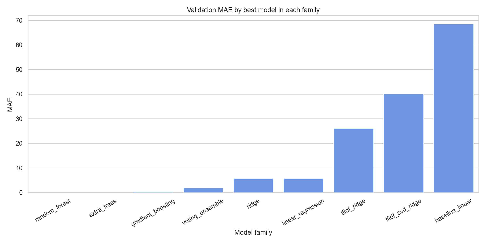
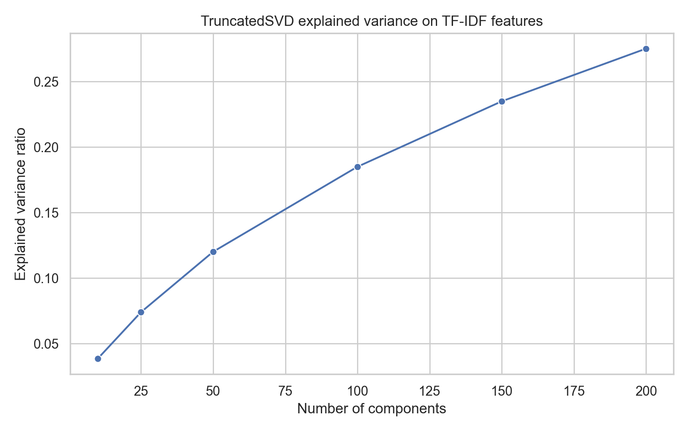
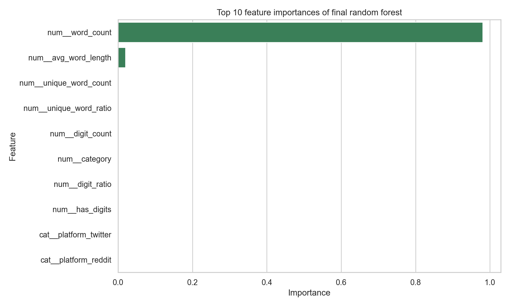

# Отчёт по проекту

**Студент:** Лисота Александр Юрьевич 
**Группа:** БИВ236

---

## 1. Введение и постановка задачи

- **Цель проекта:** предсказать длину текстового сообщения в символах по его характеристикам для двух платформ: Twitter и Reddit. Такая задача полезна для автоматического планирования лимитов, оценки ожидаемой вовлечённости, предварительной модерации и подбора формата ответа под площадку.
- **Формулировка задачи:** задача регрессии. Целевая переменная `message_length` строится как количество символов в очищенном тексте сообщения.
- **Особенность постановки:** исходный датасет размечен для sentiment analysis, но для данного проекта он переиспользуется для регрессии. Это допустимо, потому что в нём есть сами тексты сообщений, а длина сообщения однозначно вычисляется из поля с текстом.
- **Обоснование метрик качества:**
  - **Основная метрика: MAE.** Она показывает среднюю абсолютную ошибку в символах и легко интерпретируется: например, MAE = 12 означает, что модель в среднем ошибается на 12 символов.
  - **Дополнительные метрики: RMSE и R².** RMSE сильнее штрафует редкие большие ошибки, что важно из-за длинного хвоста у Reddit-комментариев. R² нужен как относительная мера, показывающая, какую долю дисперсии длины объясняет модель.
  - **Приоритет:** при сравнении моделей основной упор делается на **MAE**, потому что она наиболее понятна для прикладной интерпретации и менее чувствительна к нескольким очень длинным комментариям, чем RMSE.

---

## 2. Поиск и описание данных

- **Источник данных:** были найдены открытые файлы `Twitter_Data.csv` и `Reddit_Data.csv`, входящие в датасет *Twitter and Reddit Sentimental Analysis Dataset* из Kaggle:
  - https://www.kaggle.com/datasets/cosmos98/twitter-and-reddit-sentimental-analysis-dataset
- **Почему выбран именно этот источник:**
  - в нём уже есть два разных домена текстов, что удобно для сравнения платформ;
  - объём данных достаточно большой для регрессии даже без тяжёлых нейросетевых моделей;
  - тексты уже очищены, поэтому можно сосредоточиться на построении признаков длины, а не на парсинге сырых HTML/emoji/markup;
  - есть дополнительный признак `category`, который можно использовать как вспомогательную характеристику сообщения.

- **Исходные данные по платформам:**
  - `Twitter_Data.csv`: **162980 строк, 2 столбца**
  - `Reddit_Data.csv`: **37249 строк, 2 столбца**
  - После объединения в единый датасет: **200229 строк, 3 столбца** (`text`, `category`, `platform`)

- **Описание признаков до feature engineering:**
  - `text` - очищенный текст сообщения (`string`)
  - `category` - метка тональности из исходного датасета (`-1`, `0`, `1`), тип `float/int`
  - `platform` - источник сообщения: `twitter` или `reddit`, тип `category/string`

- **Целевая переменная:**
  - `message_length` - число символов в сообщении после очистки текста

- **Достаточность объёма данных:**
  - Для учебной задачи объём достаточен: после очистки осталось **198770** наблюдений.
  - Данные несбалансированы по платформам: около **81.99%** Twitter и **18.01%** Reddit, поэтому при сплите нужно сохранять доли платформ.
  - Ограничение датасета в том, что это уже очищенные тексты. Из-за этого недоступны некоторые потенциально полезные признаки сырых сообщений, например эмодзи, оригинальная пунктуация, хэштеги и ссылки.

---

## 3. Обработка и подготовка данных

- **Полная очистка:**
  - **Пропуски:** найдено **104** пропуска в `text` и **7** пропусков в `category`. Строки без текста удалены, потому что для них невозможно вычислить целевую переменную. Пропуски в `category` не удалялись, так как это вспомогательный признак; для модели их можно будет обрабатывать отдельно через индикатор пропуска.
  - **Пустые строки:** дополнительно найдено **122** пустых или состоящих только из пробелов сообщений. Они удалены.
  - **Дубликаты:** найдено **452** дубликата по паре (`text`, `platform`). Они удалены до разбиения на выборки, чтобы одинаковые сообщения не попали одновременно в train и test.
  - **Выбросы:** длина сообщений на Reddit имеет длинный правый хвост. Все длинные сообщения не удалялись автоматически как «ошибки», потому что для Reddit это может быть валидное поведение. Вместо этого был применён мягкий фильтр по **99.5-му перцентилю** целевой переменной: сохранены сообщения длиной до **944** символов. Такой подход убирает экстремальный хвост, но сохраняет основную вариативность данных.
  - **Типы данных:** `text` приведён к `string`, `category` к числовому типу, `message_length` и счётчики признаков - к целочисленным типам.

- **Итог после очистки:**
  - было: **200229** строк
  - стало: **198770** строк
  - итоговое число столбцов после генерации признаков: **12**

- **Работа с фичами:**
  - **Исходное количество признаков:** 3 (`text`, `category`, `platform`)
  - **Новые признаки:**
    - `message_length` - целевая переменная
    - `word_count` - число слов
    - `unique_word_count` - число уникальных слов
    - `avg_word_length` - средняя длина слова
    - `unique_word_ratio` - доля уникальных слов
    - `digit_count` - число цифр в тексте
    - `digit_ratio` - доля цифр в сообщении
    - `has_digits` - бинарный признак наличия цифр
    - `sentiment_missing` - индикатор пропуска `category`
  - **Логика feature engineering:** признаки выбирались так, чтобы они описывали структуру текста, но не копировали целевую переменную напрямую через утечку. Например, `word_count` и `avg_word_length` позволяют оценить ожидаемую длину сообщения как комбинацию числа слов и их средней длины.

- **Наблюдения по зависимостям:**
  - корреляция `word_count` и `message_length`: **0.989**
  - корреляция `unique_word_ratio` и `message_length`: **-0.534**
  - корреляция `digit_count` и `message_length`: **0.165**
  - корреляция `category` и `message_length`: **0.053**
  - Самый сильный линейный предиктор длины - `word_count`, что ожидаемо. Тональность почти не связана с длиной и, вероятно, будет играть второстепенную роль.

- **Визуализации:**
  - Распределение длины сообщений по платформам:
    
  - Boxplot длины сообщений по платформам:
    
  - Зависимость между количеством слов и длиной сообщения:
    
  - Тепловая карта корреляций:
    

- **Выводы по графикам:**
  - Reddit в среднем содержит более длинные сообщения, чем Twitter.
  - У распределения длины есть выраженная асимметрия вправо, особенно у Reddit.
  - Между `word_count` и длиной сообщения наблюдается почти линейная зависимость.
  - Платформа сообщения сама по себе является важной полезной характеристикой.

- **Сплит данных:**
  - Использовалось разбиение **70/15/15**:
    - `train`: **139138** строк
    - `val`: **29816** строк
    - `test`: **29816** строк
  - Разбиение выполнялось **stratified split** по комбинации `platform` и квантильных бинов целевой переменной `message_length`. Это позволило сохранить в каждой части и доли платформ, и форму распределения длины.
  - Доли платформ после сплита совпали во всех частях: примерно **81.99% Twitter** и **18.01% Reddit**.

- **Как избегали data leakage:**
  - дубликаты удалялись **до** сплита;
  - параметры очистки и последующей трансформации для модели должны вычисляться только на `train`;
  - целевая переменная `message_length` не используется как входной признак;
  - признаки строятся только из самого текста и служебных полей, без использования статистик из test-части.

---

## 4. Baseline-модель

- **Идея baseline:** в качестве стартовой точки была взята простая `LinearRegression` **без feature engineering**. На вход подавались только минимальные доступные признаки:
  - `category`
  - `sentiment_missing`
  - `platform`
- **Почему это корректный baseline:** модель использует только исходные служебные поля и не опирается на построенные текстовые характеристики вроде `word_count` или `avg_word_length`.

- **Результаты baseline:**

| Модель | Фичи | MAE (val) | RMSE (val) | R² (val) | MAE (test) | RMSE (test) | R² (test) |
|--------|------|-----------|------------|----------|------------|-------------|-----------|
| LinearRegression baseline | `category`, `sentiment_missing`, `platform` | 68.503 | 91.779 | 0.006 | 68.185 | 90.824 | 0.006 |

- **Вывод:** baseline почти не объясняет вариацию длины сообщений. Это ожидаемо: тональность и платформа сами по себе содержат слишком мало информации о количестве символов. Поэтому baseline нужен именно как точка отсчёта, относительно которой видно пользу feature engineering.

---

## 5. Эксперименты

- **Постановка экспериментов:** все модели обучались на `train`, гиперпараметры выбирались по `val`, а итоговое сравнение выполнялось на `test`. Основной критерий выбора - **минимум MAE на validation**.

- **Набор моделей:**
  - `LinearRegression` на engineered tabular features
  - `Ridge`
  - `RandomForestRegressor`
  - `ExtraTreesRegressor`
  - `GradientBoostingRegressor`
  - `VotingRegressor` как ансамбль из Ridge + ExtraTrees + GradientBoosting
  - `TF-IDF + Ridge`
  - `TF-IDF + TruncatedSVD + Ridge`

- **Гипотезы:**
  - линейные модели должны дать сильный результат, потому что длина текста почти линейно связана с `word_count` и `avg_word_length`;
  - деревья и ансамбли смогут лучше обработать нелинейности и редкие случаи;
  - текстовые `TF-IDF`-признаки сами по себе должны работать хуже engineered-фич, потому что напрямую не кодируют длину так эффективно;
  - уменьшение размерности через `TruncatedSVD` может ускорить работу с текстом, но, вероятно, ухудшит качество.

- **Перебор гиперпараметров:**
  - `Ridge`: `alpha ∈ {0.1, 1, 10, 30}`
  - `RandomForestRegressor`: `max_depth ∈ {20, None}`, `min_samples_leaf ∈ {1, 3}`, `n_estimators = 180`
  - `ExtraTreesRegressor`: `max_depth ∈ {30, None}`, `min_samples_leaf ∈ {1, 3}`, `n_estimators = 220`
  - `GradientBoostingRegressor`: `learning_rate ∈ {0.05, 0.1}`, `max_depth ∈ {3, 5}`, `n_estimators = 220`
  - `TF-IDF + Ridge`: `alpha ∈ {0.5, 1, 5}`, `max_features ∈ {3000, 5000}`
  - `TF-IDF + TruncatedSVD + Ridge`: `n_components ∈ {50, 100, 200}`, `alpha ∈ {0.5, 1, 5}`

- **Лучшие результаты по семействам моделей:**

| Модель | Признаки | Лучшие параметры | MAE (val) | RMSE (val) | R² (val) | MAE (test) | RMSE (test) | R² (test) |
|--------|----------|------------------|-----------|------------|----------|------------|-------------|-----------|
| Baseline LinearRegression | minimal tabular | без tuning | 68.503 | 91.779 | 0.006 | 68.185 | 90.824 | 0.006 |
| LinearRegression | engineered tabular | без tuning | 5.805 | 9.971 | 0.988 | 5.773 | 9.682 | 0.989 |
| Ridge | engineered tabular | `alpha = 30` | 5.803 | 9.968 | 0.988 | 5.771 | 9.681 | 0.989 |
| RandomForestRegressor | engineered tabular | `max_depth=None`, `min_samples_leaf=1`, `n_estimators=180` | **0.075** | 1.485 | 0.99974 | **0.065** | 1.189 | 0.99983 |
| ExtraTreesRegressor | engineered tabular | `max_depth=30`, `min_samples_leaf=1`, `n_estimators=220` | 0.089 | 1.567 | 0.99971 | 0.083 | 1.684 | 0.99966 |
| GradientBoostingRegressor | engineered tabular | `learning_rate=0.05`, `max_depth=5`, `n_estimators=220` | 0.454 | 1.097 | 0.99986 | 0.445 | 1.066 | 0.99986 |
| VotingRegressor | engineered tabular | Ridge + ExtraTrees + GBR | 1.971 | 3.621 | 0.99845 | 1.960 | 3.425 | 0.99859 |
| TF-IDF + Ridge | text only | `alpha=1`, `max_features=5000` | 26.170 | 42.846 | 0.783 | 25.837 | 41.872 | 0.789 |
| TF-IDF + TruncatedSVD + Ridge | text + SVD | `n_components=200`, `alpha=5` | 40.099 | 60.241 | 0.572 | 39.491 | 58.772 | 0.584 |

- **Ключевые наблюдения:**
  - Feature engineering дал огромный прирост относительно baseline: MAE упал с **68.5** до **5.8** уже на обычной линейной регрессии.
  - Лучшие результаты показали деревья решений и их ансамбли, особенно `RandomForestRegressor`.
  - `ExtraTreesRegressor` оказался очень близок к лидеру, но немного хуже по MAE и заметно хуже по RMSE на test.
  - `GradientBoostingRegressor` даёт хороший RMSE, но уступает лидерам по MAE.
  - `VotingRegressor` оказался хуже одиночного `RandomForestRegressor`, то есть ансамблирование не всегда улучшает лучший базовый алгоритм.
  - Текстовые модели на `TF-IDF` заметно слабее engineered tabular-признаков. Это показывает, что для данной задачи важнее явно описать структуру текста, чем подавать набор слов как есть.

- **Уменьшение размерности:**
  - Для табличных признаков уменьшение размерности не проводилось, потому что их и так мало.
  - Для текстового представления использовался `TruncatedSVD` поверх `TF-IDF`.
  - Накопленная объяснённая дисперсия росла медленно:
    - 50 компонент: **0.120**
    - 100 компонент: **0.185**
    - 150 компонент: **0.235**
    - 200 компонент: **0.275**
  - Это значит, что компактное низкоразмерное представление теряет слишком много информации.
  - На практике это подтвердилось метриками: `TF-IDF + SVD + Ridge` работает хуже, чем `TF-IDF + Ridge` без снижения размерности.

- **Визуализации по экспериментам:**
  - Сравнение лучших моделей по MAE:
    
  - Объяснённая дисперсия `TruncatedSVD`:
    

- **Полная таблица всех запусков:** сохранена в `data/processed/model_experiments.csv`.

---

## 6. Финальная модель и интерпретируемость

- **Финальная модель:** `RandomForestRegressor` на engineered tabular features.

- **Почему выбрана именно она:**
  - лучшая метрика **MAE на validation**: **0.075**
  - лучшая метрика **MAE на test** среди проверенных моделей: **0.065**
  - очень высокое качество по всем метрикам: `RMSE = 1.189`, `R² = 0.99983`
  - модель устойчива и не требует снижения размерности
  - по качеству она лучше как линейных моделей, так и текстовых `TF-IDF`-подходов

- **Финальное переобучение после выбора модели:**
  - после выбора лучшей конфигурации модель была переобучена на объединении `train + val`
  - итоговые метрики на `test`:
    - **MAE = 0.055**
    - **RMSE = 1.147**
    - **R² = 0.99984**

- **Интерпретируемость:**
  - важности признаков у финальной модели показывают, что задача почти полностью определяется двумя характеристиками:
    - `word_count`: **0.9803**
    - `avg_word_length`: **0.0196**
  - остальные признаки дают минимальный вклад:
    - `unique_word_count`: **0.000056**
    - `unique_word_ratio`: **0.000033**
    - `digit_count`: **0.000007**
    - `category`: **0.000006**
    - `digit_ratio`, `has_digits`, `platform` - ещё меньше

- **Интерпретация результата:**
  - длина сообщения почти полностью восстанавливается из количества слов и средней длины слова;
  - платформа и тональность помогают очень слабо;
  - это объясняет, почему engineered tabular features намного сильнее моделей на голом `TF-IDF`.

- **Визуализация важности признаков:**
  - 

- **Честное ограничение постановки:**
  - задача в такой формулировке получилась почти детерминированной, потому что целевая переменная напрямую связана с признаками `word_count` и `avg_word_length`.
  - Поэтому очень высокие метрики не означают, что задача в целом «сложная», а скорее показывают, что выбранные признаки почти полностью восстанавливают длину текста.

---

## 7. Деплой

- **Интерфейс:** если требуется по задаче (Streamlit, Telegram-бот и т.д.)
- **API:** FastAPI или аналог - описание эндпоинтов, примеры запросов
- **Скриншоты** работы интерфейса/API
- **Ссылка на видео** демонстрации работы

---

## 8. Заключение и выводы

- **Итоги:** достигнутые результаты, сравнение с baseline
- **Ограничения:** что не удалось, почему
- **Возможные улучшения:** идеи для дальнейшей работы
